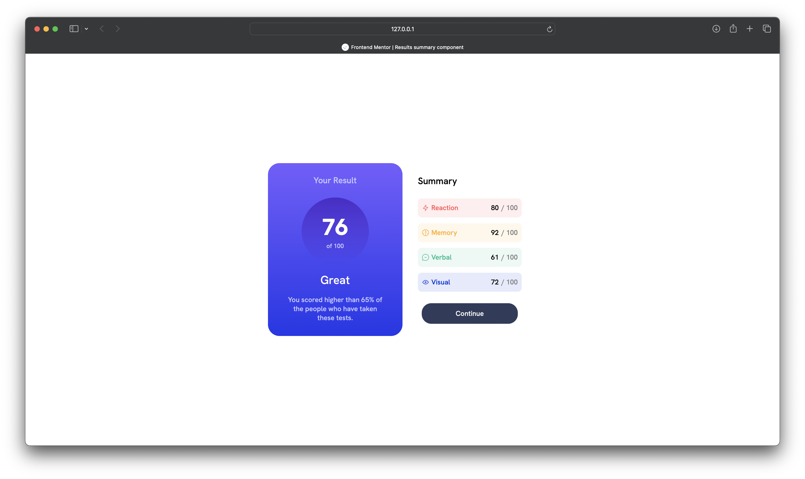

# Frontend Mentor - Results summary component solution

This is a solution to the [Results summary component challenge on Frontend Mentor](https://www.frontendmentor.io/challenges/results-summary-component-CE_K6s0maV). Frontend Mentor challenges help you improve your coding skills by building realistic projects.

## Table of contents

- [Overview](#overview)
  - [The challenge](#the-challenge)
  - [Screenshot](#screenshot)
  - [Links](#links)
- [My process](#my-process)
  - [Built with](#built-with)
  - [What I learned](#what-i-learned)
  - [Useful resources](#useful-resources)
- [Author](#author)

## Overview

### The challenge

Users should be able to:

- View the optimal layout for the interface depending on their device's screen size
- See hover and focus states for all interactive elements on the page

### Screenshot

### Links

- Live Site URL: [example](https://your-live-site-url.com)

## My process

### Built with

- Flexbox

### What I learned

I learned a lot about flexbox and it's properties though I'm still confused when I do face some issue but, it seems like I have got some kinda hang on it.

### Useful resources

- [Example resource 1](https://www.chatgpt.com) - Helped me to find a bug that I face
- [SuperSimpleDev](https://www.youtube.com/watch?v=G3e-cpL7ofc&t=17188s) - This channel helped me understand a lot of the basics behind CSS.

## Author

- Frontend Mentor - [@abelparayil](https://www.frontendmentor.io/profile/abelparayil)
- LinkedIn - [abelparayil](https://www.linkedin.com/in/abelparayil/)
- Twitter - [@abelparayil](https://twitter.com/abelparayil)
